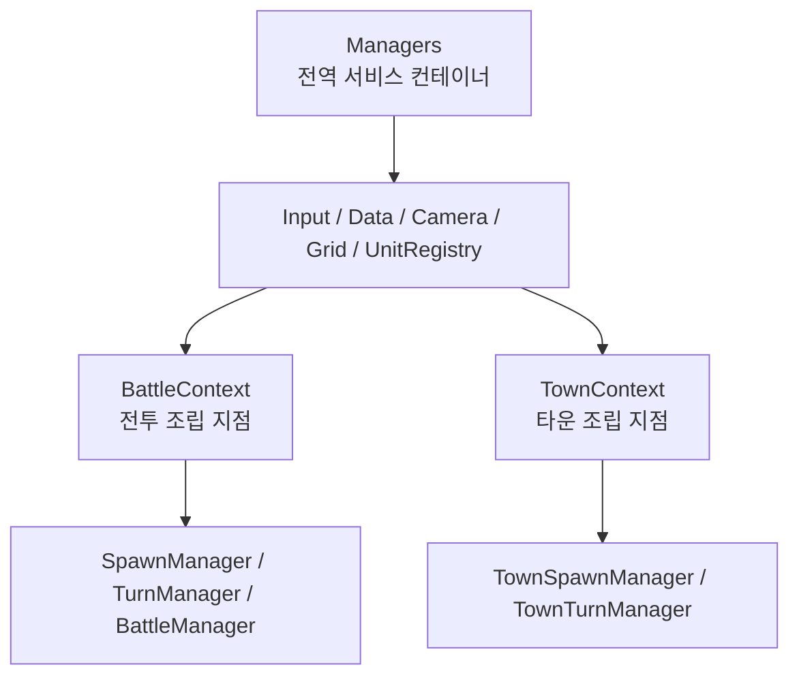
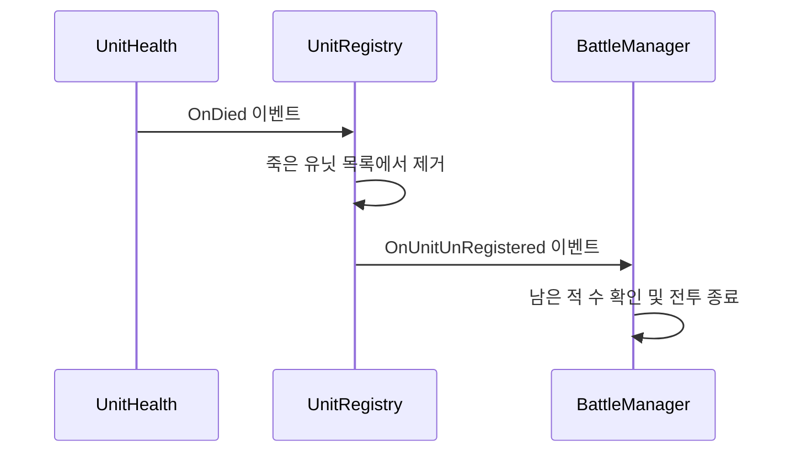

# GridRPG

> Unity 기반 1차원 그리드 RPG 개인 프로젝트  
> 턴제 전투, 타운 탐색, 데이터 기반 스폰 시스템을 구현하며 게임 클라이언트 구조를 학습하고 있습니다.

## 프로젝트 개요

| 항목 | 내용 |
| --- | --- |
| 개발 형태 | 개인 프로젝트 |
| 개발 기간 | 2026.04 ~ 개발 중 |
| 엔진 | Unity 6 `6000.3.5f2` |
| 언어 | C# |
| 주요 기술 | Unity Input System, Cinemachine, Animancer, ScriptableObject, Google Sheets CSV |
| 담당 영역 | 클라이언트 구조 설계, 전투 및 타운 시스템, 데이터 연동, 카메라, UI 기반 구조 |

GridRPG는 타일 위에서 유닛의 위치와 방향을 활용해 행동하는 RPG 프로토타입입니다.
전투에서는 플레이어와 적이 턴을 주고받고, 타운에서는 자유 이동과 턴 모드를 전환하여 NPC 행동을 확인할 수 있도록 개발하고 있습니다.

## 핵심 구현 기능

### 턴제 전투

- 플레이어 턴과 적 턴이 교대로 진행되는 전투 흐름
- 타일 기반 이동, 방향 전환, 일반 공격, 밀치기 공격
- 여러 액션을 예약하고 순차 실행하는 액션 큐
- 적이 다음 행동과 남은 턴을 표시하는 의도 시스템
- 유닛 사망 이벤트와 모든 적 처치 시 전투 종료 처리

### 타운 탐색 및 타운 턴

- 실시간 좌우 이동이 가능한 자유 탐색 모드
- 가까운 타일에 정렬한 뒤 행동하는 타운 턴 모드
- 플레이어 행동 이후 중립 NPC의 의도를 순차 실행
- NPC의 좌, 우, 정면, 후면 방향 상태 지원
- 중립 NPC와 플레이어가 타일을 공유할 수 있는 점유 규칙

### 데이터 기반 콘텐츠 구성

- Google Sheets 데이터를 CSV로 받아 ScriptableObject에 적용
- 타운별 타일 개수, 간격, 시작 위치를 데이터로 관리
- 프리팹 키와 타일 인덱스를 이용한 플레이어 및 NPC 스폰
- 스폰 데이터에서 유닛 방향과 위치 오프셋 설정

### 카메라 및 애니메이션

- 플레이어 추적 카메라와 전투 카메라 상태 전환
- 생성된 전투 그리드의 중앙 좌표를 기준으로 LookAt 타겟을 런타임 생성
- 이동, 공격, 피격, 사망 애니메이션 흐름 연결
- 사망한 유닛이 Idle 애니메이션으로 돌아가지 않도록 처리

## 클라이언트 구조

전역 서비스와 씬 전용 게임 흐름을 분리해, 각 클래스가 담당하는 책임을 명확하게 유지하려고 했습니다.

- `Managers`는 입력, 데이터, 카메라처럼 씬이 바뀌어도 유지되는 서비스를 관리합니다.
- `BattleContext`는 전투씬에서만 필요한 매니저를 생성하고 연결합니다.
- `TownContext`는 타운씬의 그리드 생성, 액터 스폰, 타운 턴 흐름을 관리합니다.
- `UnitRegistry`는 유닛 목록과 등록 상태만 관리하며, 승패 판단은 `BattleManager`가 담당합니다.

## 주요 문제 해결 경험

### 1. 전역 매니저에 집중되던 책임 분리

초기에는 전투 매니저 접근이 전역 `Managers`에 집중되어 타운 시스템을 추가할수록 의존성이 커질 가능성이 있었습니다.
전투와 타운에 각각 `BattleContext`, `TownContext`를 도입하여 씬 전용 매니저의 생성과 생명주기를 분리했습니다.

**결과**

- 전투와 타운 코드가 서로의 매니저에 직접 의존하지 않게 됨
- 씬 종료 시 이벤트 구독 해제와 리소스 정리 위치가 명확해짐
- 새로운 씬 전용 시스템을 추가하기 쉬운 구조 확보

### 2. 유닛 목록 관리와 전투 종료 판단 분리

유닛 등록 클래스가 전투 종료까지 판단하면 목록 관리와 게임 흐름이라는 두 책임이 섞이게 됩니다.
`UnitRegistry`는 유닛 등록, 해제, 분류만 담당하고, 적 사망 후 승리 조건은 `BattleManager`가 판단하도록 구성했습니다.

### 3. 씬 오브젝트 검색에 의존하지 않는 전투 카메라

전투 카메라가 이름 기반 오브젝트 검색에 의존하면 씬 구성 변경에 취약해집니다.
`GridManager`가 생성한 첫 타일과 마지막 타일로 중앙 좌표를 계산하고, 카메라 LookAt 타겟을 런타임에 생성하도록 변경했습니다.

**결과**

- `GameObject.Find` 의존 제거
- 그리드 크기가 달라져도 전투 카메라가 중앙을 바라봄
- 씬에 별도 타겟 오브젝트를 수동 배치할 필요가 없어짐

### 4. 타운 콘텐츠를 코드 수정 없이 배치

타운마다 플레이어와 NPC 위치를 코드에 직접 작성하면 콘텐츠 수정 비용이 커집니다.
Google Sheets의 타운 맵 및 스폰 데이터를 읽어 그리드와 액터를 생성하도록 구성했습니다.

**결과**

- 타일 수, 스폰 위치, 방향을 시트에서 수정 가능
- 프리팹 키를 통해 데이터와 Unity 에셋 연결
- 타운 추가 시 코드 변경 범위 감소

## 현재 개발 상태

| 상태 | 기능 |
| --- | --- |
| 구현 완료 | 전투 그리드, 유닛 스폰, 플레이어 및 적 턴, 이동, 방향 전환, 일반 공격, 밀치기 공격 |
| 구현 완료 | 전투 카메라 전환, 적 의도, 유닛 사망, 적 전멸 승리 조건 |
| 구현 완료 | 타운 데이터 로드, 타운 그리드 및 액터 스폰, 자유 이동, 타운 턴, NPC 의도 |
| 개발 중 | 찌르기 공격, 대화 UI, 상호작용 및 포털, 타운과 전투 사이의 완전한 게임 루프 |
| 개선 예정 | 플레이 영상과 스크린샷, 핵심 코드 샘플, 자동화 테스트, 빌드 설정 정리 |

## 개발 방향

- 타운 탐색에서 전투 진입, 전투 종료 후 타운 복귀까지 이어지는 플레이 루프 완성
- 액션 종류와 적 행동 패턴 확장
- 대화, 상호작용, 포털 시스템 구현
- 핵심 매니저와 턴 흐름에 대한 테스트 추가
- 플레이 영상과 구조도를 활용한 포트폴리오 문서 개선

## 저장소 공개 범위

실제 Unity 프로젝트 저장소는 유료 에셋과 전체 프로젝트 리소스를 포함하고 있어 비공개로 관리하고 있습니다.
이 저장소에는 직접 구현한 클라이언트 시스템의 설계와 개발 과정을 중심으로 정리하며, 공개 가능한 코드 샘플과 플레이 자료를 순차적으로 추가할 예정입니다.
