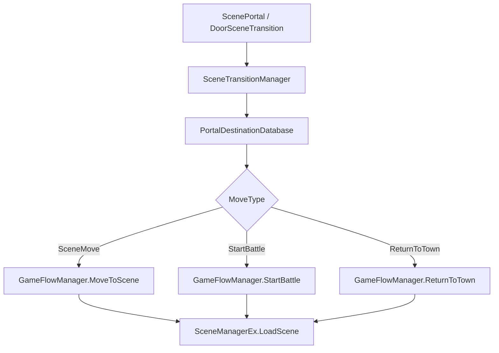

# GridRPG

Unity 기반 1차원 그리드 RPG 개인 프로젝트입니다.  
전투 모드와 마을 모드를 분리하고, 데이터 기반 맵/스폰/대화/씬 이동 구조를 직접 구현하며 게임 클라이언트 구조를 학습하고 있습니다.

이 문서는 `ra-ku/GridRPG` 저장소의 실제 코드와 Git 커밋 기록을 기준으로 작성했습니다.

## 프로젝트 개요

| 항목 | 내용 |
| --- | --- |
| 개발 형태 | 개인 학습 프로젝트 |
| 커밋 기록 기준 개발 기간 | 2026.05 ~ 진행 중 |
| 엔진 | Unity 6 `6000.3.5f2` |
| 언어 | C# |
| 주요 패키지/기술 | Unity Input System, Cinemachine, Animancer, ScriptableObject, Google Sheets CSV |
| 주요 구현 영역 | 턴제 전투, 마을 탐색, 대화/상호작용, 데이터 기반 스폰/씬 이동, 카메라 제어, 적 의도 AI |

## 핵심 구현 기능

### 턴제 전투

- `BattleContext`가 배틀씬 전용 매니저를 조립하고 초기화합니다.
- `TurnManager`가 플레이어 턴과 적 턴 흐름을 관리합니다.
- `BattleManager`가 전투 상태, 승패 조건, 전투 종료 후 흐름을 담당합니다.
- `UnitRegistry`는 유닛 등록/해제와 목록 관리만 담당하도록 역할을 분리했습니다.
- 유닛 사망은 `UnitHealth.OnDied` 이벤트로 알리고, 사망한 유닛은 이동 점유 대상에서 제외되도록 처리했습니다.

### 액션과 적 의도 시스템

- `BaseAction`을 기반으로 이동, 방향 전환, 검 공격, 강타, 차지, 배후 이동 액션을 구성했습니다.
- 적은 즉시 행동하지 않고 `EnemyIntent`에 다음 행동을 예약합니다.
- `EnemyController`는 플레이어 위치와 방향을 기준으로 다음 의도를 선택합니다.
- 방향이 맞지 않으면 `SwitchStanceAction`을 먼저 예약합니다.
- 공격 범위 안이면 공격 의도를 만들고, 접근 가능하면 이동 의도를 만듭니다.
- 이동이 막히면 `ChargeAction`으로 다음 공격 피해량을 누적합니다.
- 차지가 최대치인 상태에서도 막혀 있으면 `FlankAction`으로 플레이어 뒤쪽 빈 타일 중 하나를 선택해 이동합니다.
- `EnemyIntentFeedback`을 통해 의도 선택 시 액션 타입별 애니메이션 피드백을 재생할 수 있도록 분리했습니다.

### 마을 탐색과 상호작용

- 마을에서는 플레이어가 자유롭게 좌우 이동할 수 있습니다.
- `PlayerInteractor`가 범위 안의 `ITownInteractable` 대상 중 가까운 대상을 선택합니다.
- NPC와 오브젝트가 공용 `Dialogue` 흐름을 사용할 수 있도록 구성했습니다.
- `TownInteractableObject`를 통해 문, 포탈, 대화 오브젝트 같은 마을 상호작용을 처리합니다.
- `ScenePortal`은 트리거 기반 이동, `DoorSceneTransition`은 상호작용 기반 이동을 담당합니다.

### 조건 기반 대화

`DialogueLines` 데이터의 `ConditionType` 값에 따라 같은 `DialogueId`에서도 상황별 대사를 선택합니다.

| 조건 | 동작 |
| --- | --- |
| `FirstTalk` | 해당 대화를 처음 완료하기 전 출력 |
| `AfterFirstTalk` | 첫 대화 이후 1회성 후속 대사로 출력 |
| `Always` | 반복 대화용 기본 대사 |
| `AfterBattleVictory` | 마지막 전투 결과가 승리일 때 우선 출력 |

최근 수정으로 `FirstTalk -> AfterFirstTalk -> Always` 흐름을 명확히 분리했습니다.  
`Always`가 없는 경우에는 이미 완료한 `FirstTalk`로 되돌아가지 않고 `AfterFirstTalk`를 유지하도록 보완했습니다.

### 데이터 기반 콘텐츠 구성

- Google Sheets CSV 데이터를 런타임 데이터베이스로 파싱합니다.
- `TownMapDatabase`, `BattleMapDatabase`로 마을/전투 그리드 생성 정보를 관리합니다.
- `TownSpawnDatabase`, `BattleSpawnDatabase`로 플레이어, NPC, 적, 포탈, 오브젝트 스폰 정보를 관리합니다.
- `PrefabDatabase`로 데이터상의 프리팹 키와 Unity 프리팹 참조를 연결합니다.
- `PortalDestinationDatabase`로 포탈/문 목적지를 데이터화했습니다.
- `DialogueDataBase`가 CSV에서 파싱된 대화 클립을 조건별로 보관하고 선택합니다.

### 씬 이동 구조

`SceneTransitionManager`가 포탈/문 ID를 목적지 데이터와 연결하고, 실제 이동 흐름은 `GameFlowManager`가 관리합니다.

이 구조로 자동 포탈, 상호작용 문, 전투 진입, 전투 종료 후 마을 복귀 흐름을 같은 목적지 데이터 기반으로 처리합니다.

### 카메라

- `CameraRig`가 플레이어 추적 카메라와 전투 카메라 전환을 담당합니다.
- 전투 카메라는 생성된 전투 그리드 중심을 바라보도록 런타임 LookAt 타겟을 생성합니다.
- 마을 카메라는 플레이어를 따라가되, 맵 끝에서는 화면이 맵 밖으로 넘어가지 않도록 X축 경계를 제한합니다.
- Cinemachine 확장 컴포넌트 `TownCameraBoundsExtension`을 통해 최종 카메라 위치를 보정합니다.

## 최근 커밋 기준 변경 사항

| 날짜 | 커밋 | 내용 |
| --- | --- | --- |
| 2026-06-09 | `af57424d` | 적 AI 의도 선택 로직과 `ChargeAction`, `FlankAction`, `EnemyIntentFeedback` 추가 |
| 2026-06-09 | `c90ba57c` | NPC와 오브젝트 공용 대화 상호작용 처리 추가 |
| 2026-06-09 | `4aec0cb9` | 마을 카메라 맵 경계 제한 추가 |
| 2026-06-07 | `c4d9e5aa` | 포탈 목적지 데이터 기반 씬 이동 흐름 정리 |
| 2026-06-05 | `f6a0d3f7` | 대화 조건, 전투 맵 데이터, 사운드 매니저 추가 |
| 2026-06-04 | `8717afac` | Town-Battle 코어 루프와 전투 스폰 데이터 추가 |

## 설계 과정에서 고려한 위험

### 전역 매니저에 책임이 집중될 위험

전투와 마을 로직이 모두 전역 `Managers`에 모이면 씬별 흐름이 섞일 수 있습니다.  
이를 줄이기 위해 전역 서비스는 `Managers`, 전투 전용 흐름은 `BattleContext`, 마을 전용 흐름은 `TownContext`가 소유하도록 나누었습니다.

### 유닛 목록 관리와 전투 종료 판단이 섞일 위험

`UnitRegistry`가 승패 판단까지 담당하면 목록 관리 클래스의 책임이 커집니다.  
현재는 `UnitRegistry`가 등록/해제만 담당하고, 모든 적 사망 같은 전투 종료 조건은 `BattleManager`가 판단합니다.

### 의도 UI와 AI 판단이 결합될 위험

적 AI 판단, 의도 저장, UI 표시, 애니메이션 피드백이 한 클래스에 모이면 확장이 어려워질 수 있습니다.  
현재는 `EnemyController`, `EnemyIntent`, `EnemyActionUI`, `EnemyIntentFeedback`으로 역할을 분리했습니다.

### 대화 상태가 오브젝트 생명주기에 묶일 위험

대화 완료 여부를 NPC나 오브젝트에 저장하면 씬 이동 시 상태가 초기화될 수 있습니다.  
현재는 `DialogueManager`가 완료한 `DialogueId`와 조건별 완료 상태를 관리합니다.

## 현재 개발 상태

| 상태 | 내용 |
| --- | --- |
| 구현됨 | 전투/마을 Context 분리 |
| 구현됨 | 1차원 그리드 기반 이동과 타일 점유 관리 |
| 구현됨 | 플레이어/적 턴 전환 |
| 구현됨 | 적 의도 예약, 차지, 배후 이동 액션 |
| 구현됨 | NPC와 오브젝트 공용 대화 상호작용 |
| 구현됨 | 포탈/문 기반 씬 이동 |
| 구현됨 | 데이터 기반 맵 생성과 스폰 |
| 구현됨 | 마을 카메라 맵 경계 제한 |
| 진행 중 | 전투 액션 종류 확장 |
| 진행 중 | 의도 선택 피드백용 전용 애니메이션/이펙트 정리 |
| 향후 과제 | 전투 결과 UI, 보상 흐름, 플레이 영상/스크린샷 정리 |

## 향후 개선 과제

- `ChargeAction`, `FlankAction` 전용 아이콘과 연출을 프리팹에 안정적으로 연결
- 적 타입별 AI 패턴 분화
- 전투 결과 UI와 보상 흐름 추가
- 실제 플레이 장면을 보여줄 수 있는 GIF 또는 영상 추가
- 자동화 테스트 또는 최소한의 플레이 검증 절차 문서화
- README에 코드 샘플과 문제 해결 기록을 더 구체적으로 추가

## 공개 범위

이 저장소는 포트폴리오 정리용 README입니다.  
기능 설명은 실제 Unity 프로젝트 코드와 Git 커밋에서 확인한 내용만 포함했습니다.
